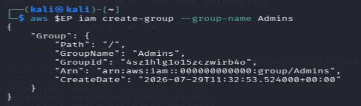
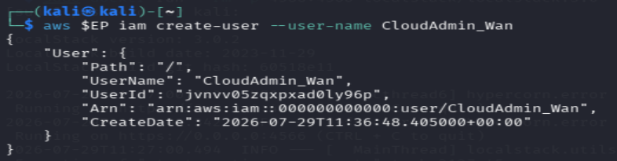
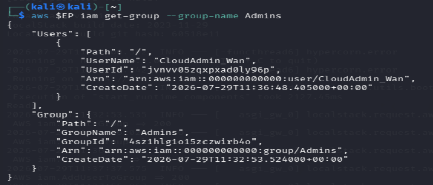
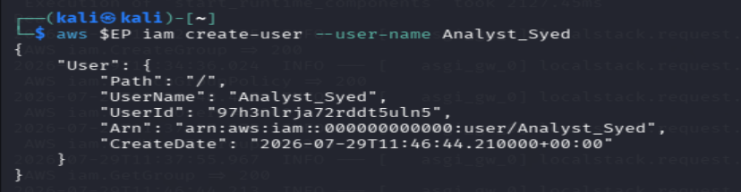
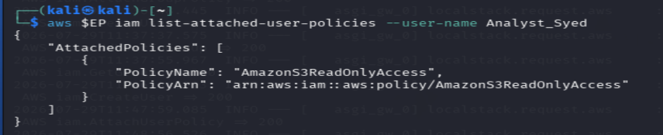
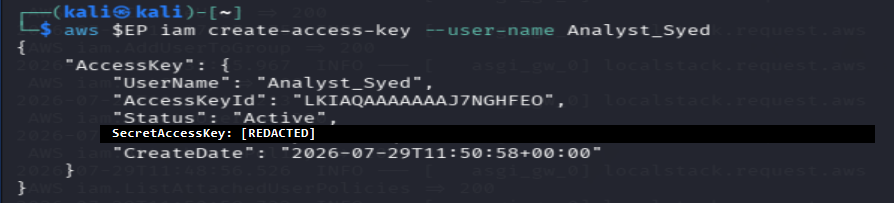
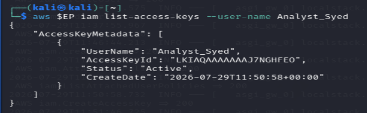

# Lab 1: Cloud Account Security, Identity and Access Management

**Course:** IKB42603 Cloud Computing Security Essentials  
**Lab:** Lab 1  
**Topic:** Identity governance, least privilege, LocalStack IAM and Kubernetes RBAC  
**Environment:** LocalStack on `localhost:4566` and kind Kubernetes cluster `ccse-lab1`  
**Name:** WAN MUHAMMAD IRFAN BIN MOHD ISA

## Lab Summary // Objective

This lab demonstrated account security and access control using two local platforms:

- **LocalStack IAM** was used to simulate AWS IAM users, groups, policies and access keys.
- **Kubernetes RBAC** was used to enforce authorization decisions through namespaced Roles and RoleBindings.

## Evidence Folder

All screenshots used for this report are stored in the `Evidence` and `Evidence part b` folders.

| Evidence File | Purpose |
|---|---|
| `Evidence/2.1createGroup.png` | Creation of the `Admins` IAM group |
| `Evidence/2.2createUserAdmin.png` | Creation of the `CloudAdmin_Wan` administrator user |
| `Evidence/2.3.verifyMembership.png` | Verification that `CloudAdmin_Wan` belongs to `Admins` |
| `Evidence/3.1createUserRead.png` | Creation of the `Analyst_Syed` analyst user |
| `Evidence/3.2verifyPolicyUserRead.png` | Verification of `AmazonS3ReadOnlyAccess` for `Analyst_Syed` |
| `Evidence/4.1createAccessKey-redacted.png` | Redacted access-key creation evidence for `Analyst_Syed` |
| `Evidence/4.2listAccessKey.png` | Access-key metadata listing for `Analyst_Syed` |
| `Evidence/4.3rotateDeactivateOld Key.png` | Access-key deactivation command |
| `Evidence/setupKubernetusCluster.png` | Kubernetes cluster and node verification |
| `Evidence/5.0listNamespace.png` | `dev` and `prod` namespace verification |
| `Evidence/6.0roleBind.png` | Service account, Role and RoleBinding creation |
| `Evidence/7.0test.png` | RBAC authorization tests |
| `Evidence/Verification.png` | RoleBinding YAML verification |

## Task 1: Map the Cloud Identity Landscape

| Concept | AWS Term | Purpose |
|---|---|---|
| All-powerful owner | Root user | Gives full, unrestricted administrative access to the entire AWS account, billing, initial setup tasks. |
| Human/app identity | IAM User | A person or application that needs long-term access credentials to interact with AWS services. |
| Permission bundle | IAM Policy | Specifies specific permissions (allowed or denied actions and resources) in a JSON document attached to identities. |
| Collection of users | IAM Group | simplifies management by allowing you to assign permissions (policies) to multiple users at once. |
| Temporary identity | IAM Role | Provides temporary access rights for users, apps or external services without requiring permanent credentials.|

## Session A: LocalStack IAM

### Environment Setup

The AWS CLI was pointed to LocalStack using:

```bash
EP='--endpoint-url=http://localhost:4566'
```

This directs AWS CLI commands to the local LocalStack endpoint rather than a real AWS account.

Verification command:

```bash
aws --endpoint-url=http://localhost:4566 sts get-caller-identity
```

Expected LocalStack identity:

```json
{
  "UserId": "000000000000",
  "Account": "000000000000",
  "Arn": "arn:aws:iam::000000000000:root"
}
```

The account ID `000000000000` identifies the LocalStack environment used for the exercises.

## Task 2: Create a Least-Privilege Admin

### Step 2.1: Create Admins Group

Command:

```bash
aws $EP iam create-group --group-name Admins
```

Result:

The `Admins` group was created successfully. The returned ARN was `arn:aws:iam::000000000000:group/Admins`.

Evidence:



### Step 2.2: Attach Administrator Policy to Group

Command:

```bash
aws $EP iam attach-group-policy --group-name Admins \
  --policy-arn arn:aws:iam::aws:policy/AdministratorAccess
```

Verification command:

```bash
aws $EP iam list-attached-group-policies --group-name Admins
```

Expected verification output:

```json
{
  "AttachedPolicies": [
    {
      "PolicyName": "AdministratorAccess",
      "PolicyArn": "arn:aws:iam::aws:policy/AdministratorAccess"
    }
  ]
}
```

This assigns administrator permissions to the group, allowing permissions to be managed centrally rather than attached directly to individual users.

### Step 2.3: Create Personal Admin User

Command:

```bash
aws $EP iam create-user --user-name CloudAdmin_Wan
```

Result:

The personal administrator user `CloudAdmin_Wan` was created successfully.

Evidence:



### Step 2.4: Add User to Admins Group and Verify Membership

Command:

```bash
aws $EP iam add-user-to-group --group-name Admins \
  --user-name CloudAdmin_Wan
```

Verification command:

```bash
aws $EP iam get-group --group-name Admins
```

Result:

The group output lists `CloudAdmin_Wan` with ARN `arn:aws:iam::000000000000:user/CloudAdmin_Wan`. This confirms that the user is a member of `Admins` and inherits its administrator permissions through group membership.

Evidence:



## Task 3: Enforce Least Privilege with a Scoped Policy

### Step 3.1: Create Read-Only Analyst User

Command:

```bash
aws $EP iam create-user --user-name Analyst_Syed
```

Result:

The user `Analyst_Syed` was created successfully.

Evidence:



### Step 3.2: Attach S3 Read-Only Policy

Command:

```bash
aws $EP iam attach-user-policy --user-name Analyst_Syed \
  --policy-arn arn:aws:iam::aws:policy/AmazonS3ReadOnlyAccess
```

### Step 3.3: Verify Analyst Permissions

Verification command:

```bash
aws $EP iam list-attached-user-policies --user-name Analyst_Syed
```

Result:

The output lists only `AmazonS3ReadOnlyAccess` with policy ARN `arn:aws:iam::aws:policy/AmazonS3ReadOnlyAccess`. This confirms that the analyst account has a read-only S3 policy attached.

Evidence:



### Least Privilege Explanation

- `Analyst_Syed` is restricted to read-only Amazon S3 access rather than being granted administrator permissions.
- If this account were compromised, an attacker would be limited to the permissions in that policy and could not use this identity to administer IAM or modify cloud resources.
- Limiting permissions in this way reduces the blast radius of a compromised identity.

## Task 4: Credential Hygiene and Access Keys

### Step 4.1: Create Access Key

Command:

```bash
aws $EP iam create-access-key --user-name Analyst_Syed
```

Result:

An access key was created for `Analyst_Syed` with status `Active`.

Evidence:



Security note: The generated screenshot contains a secret access key. Secret access keys must be treated as credentials: they must not be committed to repositories, shared publicly, or stored in plaintext. The value is intentionally not reproduced in this report text.

### Step 4.2: List Access Keys

Command:

```bash
aws $EP iam list-access-keys --user-name Analyst_Syed
```

Result:

The access-key metadata shows one key for `Analyst_Syed` and confirms that its status was initially `Active`. Listing key metadata supports credential inventory and rotation activities without exposing the secret access-key value.

Evidence:



### Step 4.3: Rotate and Deactivate Old Key

Command:

```bash
aws $EP iam update-access-key --user-name Analyst_Syed \
  --access-key-id <old-access-key-id> --status Inactive
```

Result:

The old access key was deactivated by setting its status to `Inactive`. This demonstrates the deactivation stage of access-key rotation and prevents the old credential from continuing to authenticate requests.

Evidence:


## Session B: Kubernetes RBAC

### Setup: Create Local Kubernetes Cluster

Commands:

```bash
kind create cluster --name ccse-lab1
kubectl cluster-info --context kind-ccse-lab1
kubectl get nodes
```

Result:

The local kind cluster `ccse-lab1` was available and the control-plane node was in the `Ready` state. The evidence shows Kubernetes running locally at `127.0.0.1:46533` and the node using Kubernetes version `v1.30.0`.

Evidence:


## Task 5: Separate Environments with Namespaces

Commands:

```bash
kubectl create namespace dev
kubectl create namespace prod
kubectl get namespaces
```

Result:

The `dev` and `prod` namespaces were created and both are shown as `Active`. These namespaces establish separate logical environments for access-control testing.

Evidence:


## Task 6: Define a Role and Bind It

### Step 6.1: Create Service Account

Command:

```bash
kubectl create serviceaccount dev-user -n dev
```

Result:

The service account `dev-user` was created in the `dev` namespace.

### Step 6.2: Create Pod Reader Role

Command:

```bash
kubectl create role pod-reader -n dev \
  --verb=get,list,watch --resource=pods
```

Result:

The Role `pod-reader` was created in the `dev` namespace. It permits only the `get`, `list`, and `watch` verbs for pod resources.

Note: The evidence records an initial `reate` command typo. The following corrected `kubectl create role` command completed successfully and created the Role.

### Step 6.3: Create RoleBinding

Command:

```bash
kubectl create rolebinding dev-user-binding -n dev \
  --role=pod-reader --serviceaccount=dev:dev-user
```

Result:

The RoleBinding `dev-user-binding` binds the `pod-reader` Role to the `dev-user` service account in the `dev` namespace.

Evidence:


## Task 7: Test Access Control

The Kubernetes service-account identity was stored in a shell variable:

```bash
SA=system:serviceaccount:dev:dev-user
```

This represents the `dev-user` service account in the `dev` namespace.

### Test 1: List Pods in Dev

Command:

```bash
kubectl auth can-i list pods -n dev --as=$SA
```

Result:

```text
yes
```

The request is allowed because the `pod-reader` Role grants the `list` verb on pods in the `dev` namespace.

### Test 2: Delete Pods in Dev

Command:

```bash
kubectl auth can-i delete pods -n dev --as=$SA
```

Result:

```text
no
```

The request is denied because the Role grants only `get`, `list`, and `watch`; it does not grant `delete`.

### Test 3: List Pods in Prod

Command:

```bash
kubectl auth can-i list pods -n prod --as=$SA
```

Result:

```text
no
```

The request is denied because the Role and RoleBinding are limited to the `dev` namespace. No permission was granted to this service account in `prod`.

Evidence:


### Authentication vs Authorization

Kubernetes recognises the identity `system:serviceaccount:dev:dev-user` during authentication. It then applies authorization rules to the requested action. The identity can list pods in `dev` because the RoleBinding grants that specific permission, but it cannot delete pods or access pods in `prod` because neither action was granted.

## RBAC Verification Command

Command:

```bash
kubectl get rolebinding dev-user-binding -n dev -o yaml
```

Result:

The YAML output confirms that `dev-user-binding` is a `RoleBinding` in the `dev` namespace. Its `roleRef` points to the `pod-reader` Role, and its subject is the `dev-user` ServiceAccount in `dev`.

Evidence:


## Short-Answer Questions

### Q1. Why is attaching policies to groups better than attaching them directly to users?

With policies on groups you can centralise management of permissions. A policy is applied or changed once for the group and all members inherit the change. This simplifies access reviews and reduces errors when individual user permissions are handled separately.

### Q2. What is the difference between an IAM User and an IAM Role?

An IAM User is a long-term identity that represents a person or application that can have long-lived credentials, such as access keys. IAM Role An identity that can be assumed and provides temporary credentials. Roles are often preferred by workloads since they eliminate the need for long-lived credentials.

### Q3. Explain least privilege using the Analyst account, and how it reduces blast radius if compromised.

`Analyst_Syed` is an example of least privilege as it is granted `AmazonS3ReadOnlyAccess` instead of admin access. 2. If compromised, the attacker would be restricted to the limited read permissions granted by that policy . This account would not grant them administrator capabilities, which limits the possible effect or blast radius.

### Q4. In Kubernetes, what is the difference between a Role and a RoleBinding?

A Role defines the actions that are permitted on resources within a namespace. A RoleBinding provides that Role to one or more subjects. In this lab pod-reader specifies the allowed pod actions and dev-user-binding assigns those permissions to the dev-user service account.

### Q5. Why did the developer service account fail to access prod, and which security principle does that demonstrate?

The service account was unable to access `prod` as its Role and RoleBinding exist only in the `dev` namespace. It was not assigned any permissions in `production`. This is an example of least privilege and separation of environments where there is only access to the namespace and actions that are needed.

## Security Best-Practices Checklist

- [x] Root user is not used for daily tasks (a dedicated admin identity exists).
- [x] Permissions are granted via groups/roles, not directly to individual users.
- [x] At least one least-privilege (read-only) identity was created and tested.
- [x] Access keys were listed and a rotation (deactivate) was demonstrated.
- [x] Kubernetes RBAC blocks an unauthorised action (delete / cross-namespace).

## Conclusion

This lab successfully demonstrated cloud identity management and least privilege in LocalStack IAM and Kubernetes. Administrative permissions were assigned through the `Admins` group, while `Analyst_Syed` was limited to Amazon S3 read-only access. The access-key lifecycle was also demonstrated through key creation, listing, and deactivation.

In Kubernetes, RBAC enforced a clear access boundary. The `dev-user` service account could list pods in `dev`, but could not delete pods and could not list pods in `prod`. These results demonstrate that authorization was enforced according to least privilege and namespace separation.
