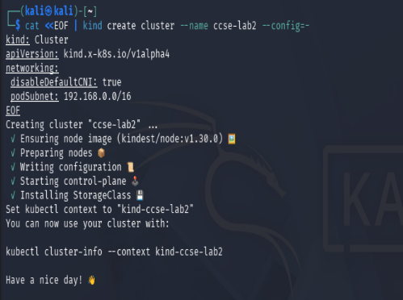
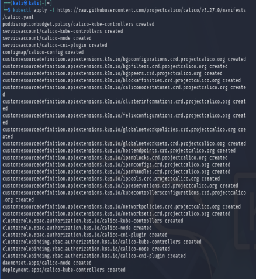
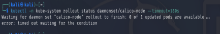
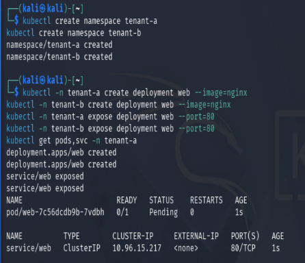
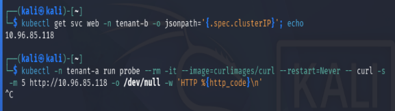
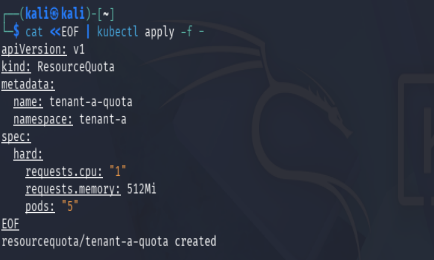
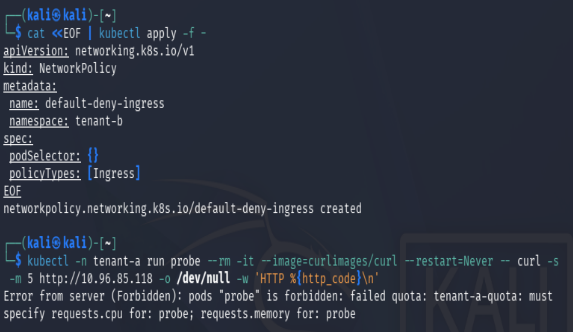
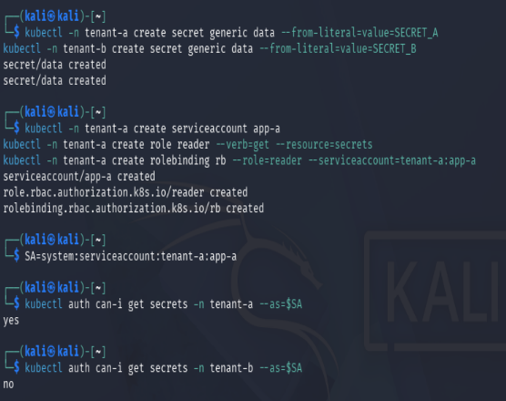
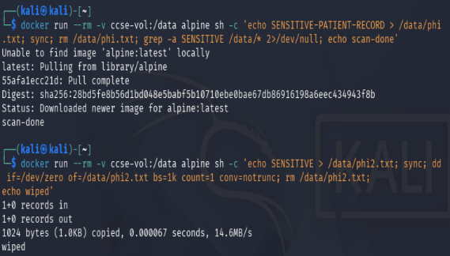

# Lab 2: Secure Isolation and Multitenancy

| Item | Details |
|---|---|
| Course | IKB42603 — Cloud Computing / Cloud Security |
| Lab title | Secure Isolation and Multitenancy |
| Student | WAN MUHAMMAD IRFAN BIN MOHD ISA |
| Student ID | 52215225234 |
| Platform | Kali Linux, Docker, kind (Kubernetes in Docker), Kubernetes, Calico |

## 1. Executive summary

This lab examined how a shared Kubernetes cluster can host multiple tenants without allowing one tenant to consume another tenant’s resources, communicate without authorisation, or read confidential data. Two namespaces, `tenant-a` and `tenant-b`, were created in one kind cluster. The lab then demonstrated the default cross-namespace exposure risk, applied a ResourceQuota to contain a noisy neighbour, defined a default-deny ingress NetworkPolicy, limited secret access with RBAC, and securely erased sensitive data from a Docker volume.

The recorded evidence confirms namespace separation, quota creation, NetworkPolicy creation, RBAC authorisation boundaries, and overwrite-based deletion. It also records two validation constraints: the Calico rollout timed out, and the NetworkPolicy test pod could not be created because the ResourceQuota requires CPU and memory requests. These observations are security-relevant and are reported rather than treated as successful enforcement tests.

## 2. Objectives

1. Build a local Kubernetes cluster suitable for network-policy testing.
2. Create two logical tenants on a shared cluster.
3. Observe the risk of permissive, default pod-to-pod connectivity.
4. Contain excessive resource use by one tenant.
5. Apply a default-deny ingress policy for tenant isolation.
6. Restrict access to secrets using least-privilege RBAC.
7. Demonstrate secure handling of residual data in persistent storage.

## 3. Lab environment and assumptions

The cluster was created with kind using a configuration that disabled kind’s default CNI and assigned the pod subnet `10.244.0.0/16`. Calico was then applied as the CNI/network-policy provider. The tenancy boundary in this exercise is a Kubernetes namespace; this is a logical isolation mechanism, not a replacement for separate clusters where stronger infrastructure isolation is required.

## 4. Methodology and results

### 4.1 Environment setup

A kind cluster named `ccse-lab2` was created with default CNI disabled. Calico v3.27.0 manifests were applied to provide networking and NetworkPolicy enforcement capability.

```bash
kind create cluster --name ccse-lab2 --config=-
# kind: Cluster
# apiVersion: kind.x-k8s.io/v1alpha4
# networking:
#   disableDefaultCNI: true
#   podSubnet: 10.244.0.0/16

kubectl apply -f https://raw.githubusercontent.com/projectcalico/calico/v3.27.0/manifests/calico.yaml
kubectl -n kube-system rollout status daemonset/calico-node --timeout=180s
```

**Command description:** `kind create cluster` provisions the local Kubernetes cluster from the supplied configuration; `kubectl apply` installs Calico’s Kubernetes resources; and `kubectl rollout status` waits for the Calico node agents to become ready, with a maximum wait time of 180 seconds.

The cluster and Calico resources were created. However, the captured rollout status reported `0 of 1 updated pods are available` and timed out after 180 seconds. This must be resolved before relying on the NetworkPolicy test as proof of packet enforcement.

Evidence: [cluster creation](Evidence/setup1.png), [Calico installation](Evidence/setup2.png), [Calico rollout result](Evidence/setup3.png).







### 4.2 Task 1 — Two tenants on one cluster

Two namespaces were created to represent independent tenants. An NGINX deployment and a ClusterIP service were then created in `tenant-a`.

```bash
kubectl create namespace tenant-a
kubectl create namespace tenant-b
kubectl -n tenant-a create deployment web --image=nginx
kubectl -n tenant-a expose deployment web --port=80
kubectl get pods,svc -n tenant-a
```

**Command description:** the first two commands create separate namespace scopes for the tenants. `create deployment` starts an NGINX workload in `tenant-a`; `expose deployment` creates an internal ClusterIP service on port 80; and `get pods,svc` checks the workload and service status in that namespace.

The evidence shows `tenant-a` and `tenant-b` were created, an NGINX deployment and `web` service were created in `tenant-a`, and the service received a ClusterIP. The displayed pod was still `Pending` at capture time, so readiness should be checked before application-level testing.

Evidence: [Task 1 — two tenants on one cluster](Evidence/Task1-TwoTenantsOnOneCluster.png).



### 4.3 Task 2 — Default open-network risk

The service IP was retrieved from `tenant-b`, and a temporary curl pod in `tenant-a` sent an HTTP request to it:

```bash
kubectl get svc web -n tenant-b -o jsonpath='{.spec.clusterIP}'
kubectl -n tenant-a run probe --rm -it --image=curlimages/curl --restart=Never -- \
  curl -s -m 5 http://10.96.85.118 -o /dev/null -w 'HTTP %{http_code}\n'
```

**Command description:** the first command extracts the internal IP address of the `web` service in `tenant-b`. The second starts a temporary curl pod in `tenant-a`, performs an HTTP request to that address with a five-second timeout, prints only the HTTP status code, and removes the probe pod when it exits.

The returned status was `HTTP 403`. Although the application denied the request, receiving an HTTP response demonstrates that the cross-namespace request reached an HTTP endpoint. Without a NetworkPolicy, namespace membership alone does not provide network isolation.

Evidence: [Task 2 — default open risk](Evidence/Task2-ObserveTheDefaultOpenRisk.png).



### 4.4 Task 3 — Contain the noisy neighbour

A ResourceQuota was applied to `tenant-a` to cap aggregate requested CPU, requested memory, and pod count.

```yaml
apiVersion: v1
kind: ResourceQuota
metadata:
  name: tenant-a-quota
  namespace: tenant-a
spec:
  hard:
    requests.cpu: "1"
    requests.memory: 512Mi
    pods: "5"
```

**Command description:** `apiVersion` and `kind` declare a Kubernetes ResourceQuota. The `metadata` section names and scopes it to `tenant-a`; `hard` sets the maximum combined requested CPU to one core, requested memory to 512 MiB, and the number of pods to five.

The quota was created successfully. This constrains scheduling reservations and pod count for `tenant-a`, reducing the risk that an uncontrolled workload monopolises shared-cluster capacity. A practical consequence is that pods in this namespace must specify CPU and memory requests.

Evidence: [Task 3 — ResourceQuota](Evidence/Task3-ContainTheNoisyNeighbour.png).



### 4.5 Task 4 — Default-deny network isolation

A namespace-scoped default-deny ingress policy was created in `tenant-b`:

```yaml
apiVersion: networking.k8s.io/v1
kind: NetworkPolicy
metadata:
  name: default-deny-ingress
  namespace: tenant-b
spec:
  podSelector: {}
  policyTypes:
    - Ingress
```

**Command description:** this NetworkPolicy selects every pod in `tenant-b` using `podSelector: {}`. Declaring `Ingress` without any allow rules denies all inbound connections to those selected pods by default.

The policy was accepted by Kubernetes. The follow-up probe from `tenant-a` was not created because the `tenant-a-quota` admission check rejected it: the pod lacked `requests.cpu` and `requests.memory`. Therefore, the screenshot validates policy creation but does **not** validate that ingress traffic was blocked. Once Calico is healthy, rerun the probe with resource requests, for example:

```yaml
apiVersion: v1
kind: Pod
metadata:
  name: probe
  namespace: tenant-a
spec:
  restartPolicy: Never
  containers:
    - name: curl
      image: curlimages/curl
      command: ["sh", "-c", "curl -sS -m 5 http://web.tenant-b.svc.cluster.local || true"]
      resources:
        requests:
          cpu: 50m
          memory: 64Mi
```

**Command description:** this replacement probe manifest creates one short-lived curl pod in `tenant-a`. Its `resources.requests` satisfy the namespace quota, while the curl command tests whether the `tenant-b` service can be reached after default-deny ingress is active.

Expected secure outcome: the request times out or is refused by policy, rather than returning an HTTP response. To allow only approved traffic later, add narrowly scoped `ingress.from` and `ports` rules.

Evidence: [Task 4 — default-deny policy and blocked probe](Evidence/Task4-DefaultDenyNetworkIsolation.png).



### 4.6 Task 5 — Storage and secret isolation

Distinct secrets were created in each namespace. A service account in `tenant-a` was bound to a namespaced `reader` Role that permits `get` on `secrets` only in `tenant-a`.

```bash
kubectl -n tenant-a create secret generic data --from-literal=value=SECRET_A
kubectl -n tenant-b create secret generic data --from-literal=value=SECRET_B
kubectl -n tenant-a create serviceaccount app-a
kubectl -n tenant-a create role reader --verb=get --resource=secrets
kubectl -n tenant-a create rolebinding rb --role=reader --serviceaccount=tenant-a:app-a

SA=system:serviceaccount:tenant-a:app-a
kubectl auth can-i get secrets -n tenant-a --as=$SA
kubectl auth can-i get secrets -n tenant-b --as=$SA
```

**Command description:** the first two commands create separate namespace-local secrets. The next three create a workload identity (`app-a`), grant it only the `get` verb for secrets in `tenant-a`, and attach that permission to the identity. `kubectl auth can-i` then impersonates the service account to verify allowed access in `tenant-a` and denied access in `tenant-b`.

Authorisation checks returned `yes` for `tenant-a` and `no` for `tenant-b`. This confirms the intended least-privilege boundary: the service account can read secrets only in its own namespace. Secrets should still be encrypted at rest, tightly controlled through RBAC, and never exposed in logs or container images.

Evidence: [Task 5 — secret and RBAC isolation](Evidence/Task5-Storage&SecretIsolation.png).



### 4.7 Task 6 — Data remanence and secure deletion

A Docker volume was used to represent persistent data. A sensitive record was written, verified with `grep`, then overwritten with zero bytes before deletion.

```bash
docker run -v ccse-vol:/data alpine sh -c 'echo SENSITIVE-PATIENT-RECORD > /data/phi.txt; sync; rm /data/phi.txt; grep -a SENSITIVE /data/* 2>/dev/null; echo done'
docker run --rm -v ccse-vol:/data alpine sh -c 'echo SENSITIVE > /data/phi2.txt; sync; dd if=/dev/zero of=/data/phi2.txt bs=1k count=1 conv=notrunc; rm /data/phi2.txt; echo wiped'
```

**Command description:** both commands mount the persistent Docker volume `ccse-vol` at `/data` in a temporary Alpine container. The first writes a sample sensitive file, synchronises it to storage, deletes it, and searches for the marker. The second writes another sample file, uses `dd` to overwrite its first 1 KiB with zeros without truncating it, then deletes the file and reports completion.

The evidence records the overwrite operation completing (`1024 bytes copied`) and the final `wiped` status. Secure deletion reduces recoverable plaintext remnants, but on copy-on-write filesystems, SSDs, snapshots, backups, and cloud-managed storage, overwrite alone cannot guarantee physical erasure. Encryption at rest with prompt key destruction is the stronger cloud-storage control.

Evidence: [Task 6 — data remanence and secure deletion](Evidence/Task6-DataRemanence&SecureDeletion.png).



## 5. Security analysis

| Control | Threat addressed | Result / limitation |
|---|---|---|
| Namespaces | Accidental administrative and object-name overlap | Two tenant boundaries created; they do not block network traffic by themselves. |
| ResourceQuota | Noisy-neighbour resource exhaustion | Created successfully; workload manifests now need CPU/memory requests. |
| Default-deny ingress | Unauthorised lateral movement | Policy created, but enforcement must be retested after Calico readiness and a quota-compliant probe. |
| RBAC Role and RoleBinding | Cross-tenant secret disclosure | Verified: allowed in `tenant-a`, denied in `tenant-b`. |
| Overwrite before deletion | Residual plaintext on reusable storage | Demonstrated at volume level; not sufficient for all storage backends. |

## 6. Recommendations

1. Diagnose and resolve the Calico DaemonSet readiness failure, then confirm policy enforcement with an application-ready service and a probe containing resource requests.
2. Add `LimitRange` defaults or explicit resource requests/limits to every tenant workload so quotas are usable without blocking legitimate pods.
3. Apply default-deny ingress and egress policies to every tenant namespace, then add only documented allow rules for DNS, monitoring, and required application flows.
4. Use separate service accounts per workload; grant the smallest possible verbs and resources, and avoid broad ClusterRoles for tenants.
5. Enable Kubernetes secret encryption at rest, rotate credentials, and use an external secrets manager where available.
6. Prefer encrypted volumes and key destruction for lifecycle-end sanitisation; account for backups and snapshots in the deletion procedure.
7. For high-risk or regulated tenants, use dedicated node pools, stronger admission controls, or separate clusters in addition to namespace isolation.

## 7. Conclusion

This lab demonstrated the layered controls required for multitenancy in Kubernetes. Namespaces organise tenants, quotas limit fair resource consumption, NetworkPolicies are needed for network segmentation, and RBAC protects tenant-specific secrets. The evidence also highlighted that security controls must be operationally verified: a policy object existing is not equivalent to a working policy dataplane, and resource controls can affect test execution. Completing the Calico and quota-aware retest is the remaining step to establish end-to-end network-isolation evidence.

## Appendix A — Evidence index

| Figure | Description |
|---|---|
| A1 | [Kind cluster creation](Evidence/setup1.png) |
| A2 | [Calico manifest installation](Evidence/setup2.png) |
| A3 | [Calico rollout status](Evidence/setup3.png) |
| A4 | [Task 1 evidence](Evidence/Task1-TwoTenantsOnOneCluster.png) |
| A5 | [Task 2 evidence](Evidence/Task2-ObserveTheDefaultOpenRisk.png) |
| A6 | [Task 3 evidence](Evidence/Task3-ContainTheNoisyNeighbour.png) |
| A7 | [Task 4 evidence](Evidence/Task4-DefaultDenyNetworkIsolation.png) |
| A8 | [Task 5 evidence](Evidence/Task5-Storage&SecretIsolation.png) |
| A9 | [Task 6 evidence](Evidence/Task6-DataRemanence&SecureDeletion.png) |
