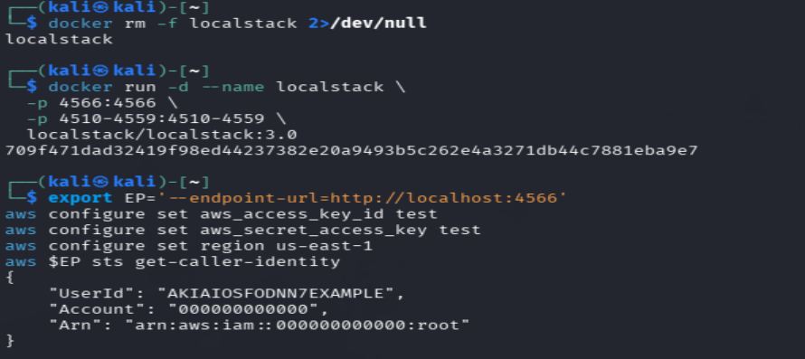

# IKB42603 Lab 6: Object Storage Security and the Data Security Lifecycle

| Item | Details |
|---|---|
| Course | IKB42603 - Cloud Computing Security |
| Lab | Lab 6: Object Storage Security and the Data Security Lifecycle |
| Student | WAN MUHAMMD IRFAN BIN MOHD ISA | 

## Aim

This lab examines how Amazon S3-style object storage can be exposed, restricted, encrypted, delegated, retained and securely destroyed. The work follows the *IKB42603_Lab6_Object_Storage_and_Data_Lifecycle* guide. `$EP` denotes the LocalStack endpoint option and `$BUCKET` the lab bucket (`miit-patient-records-22299`).

## Environment setup

LocalStack was run in Docker with S3 and KMS available. `aws configure` supplied test credentials and `aws $EP sts get-caller-identity` confirmed that the CLI could authenticate to the local service.

`docker run -d --name localstack -p 4566:4566 -p 4510-4559:4510-4559 localstack/localstack:3.0` — starts the local AWS-compatible environment.  
`aws $EP sts get-caller-identity` — validates the active CLI identity and endpoint connectivity.

## Task 1 — Classify data before storing it

Three objects were uploaded with a `classification` object tag: a public notice, an internal roster and a confidential patient record. Classification is the basis for applying proportionate access, encryption, retention and deletion controls.

| Object/key | Classification tag | Why it needs this classification | Required handling |
|---|---|---|---|
| `public/notice.txt` | `public` | Intended for general distribution; the content is non-sensitive. | May be publicly readable only after explicit approval; retain integrity controls. |
| `internal/roster.txt` | `internal` | Operational staff information, not intended for anonymous users. | Authenticated staff only; least-privilege access and monitored sharing. |
| `confidential/record.txt` | `confidential` | Contains patient identity and diagnosis; disclosure could cause privacy harm and breach policy. | Explicit deny/public block, least privilege, SSE-KMS, version-aware retention and auditable erasure. |

`aws $EP s3api put-object --bucket $BUCKET --key <key> --body <file> --tagging 'classification=<level>'` — uploads an object and records its classification tag.  
`aws $EP s3api list-objects-v2 --bucket $BUCKET` — inventories stored keys and sizes.  
`aws $EP s3api get-object-tagging --bucket $BUCKET --key confidential/record.txt` — retrieves the tag used to drive classification-aware controls.

## Task 2 — Reproduce the archetypal breach

A bucket policy allowed `s3:GetObject` to `Principal: "*"` on every object in the bucket. An unauthenticated `curl` request then retrieved the confidential record with HTTP 200. This demonstrates how a single public-read statement can expose all matching data regardless of its classification.

`aws $EP s3api put-bucket-policy --bucket $BUCKET --policy file://public-policy.json` — attaches the deliberately unsafe resource policy.  
`curl -s -o leaked.txt -w 'HTTP %{http_code}\n' <object-URL>` — performs an anonymous request and records the result code.

## Task 3 — Remediate with Block Public Access

The unsafe policy was removed and all four bucket Block Public Access settings were enabled: `BlockPublicAcls`, `IgnorePublicAcls`, `BlockPublicPolicy` and `RestrictPublicBuckets`. The configuration is a preventive guardrail against public ACLs and policies.

`aws $EP s3api delete-bucket-policy --bucket $BUCKET` — removes the exposed public-read policy.  
`aws $EP s3api put-public-access-block --bucket $BUCKET --public-access-block-configuration ...` — enables the four public-access guardrail settings.  
`aws $EP s3api get-public-access-block --bucket $BUCKET` — verifies their configured state.

The final `HTTP 200` shown after reattaching the public policy is a LocalStack emulator limitation/behaviour; it must not be interpreted as a safe result on AWS. In AWS, the account/bucket Block Public Access evaluation prevents a policy that would make the bucket public.

## Task 4 — Identity policy versus resource policy

An IAM user, `DataAnalyst`, received an identity-based policy broadly allowing `s3:GetObject` and `s3:ListBucket`. A bucket policy then allowed that principal to read `internal/*` but explicitly denied it from `confidential/*`. The analyst successfully read the internal roster and was denied the confidential record: explicit deny overrides an allow.

`aws $EP iam create-user --user-name DataAnalyst` — creates the test identity.  
`aws $EP iam put-user-policy --user-name DataAnalyst --policy-name S3ReadAll --policy-document file://analyst-iam.json` — attaches the identity-based permission.  
`aws $EP s3api put-bucket-policy --bucket $BUCKET --policy file://deny-confidential.json` — attaches the resource policy which scopes the identity and carries the explicit deny.  
`AWS_PROFILE=analyst aws $EP s3api get-object ...` — tests each request as the analyst rather than the administrator.

## Task 5 — Default encryption at rest (SSE-KMS)

Bucket default encryption was set to `aws:kms` using the lab KMS key and bucket keys were enabled. A newly uploaded confidential version reports `ServerSideEncryption: aws:kms`, the KMS key ARN and `BucketKeyEnabled: true`.

`aws $EP s3api put-bucket-encryption --bucket $BUCKET --server-side-encryption-configuration file://encryption.json` — sets default SSE-KMS for new uploads.  
`aws $EP s3api get-bucket-encryption --bucket $BUCKET` — confirms the encryption rule.  
`aws $EP s3api head-object --bucket $BUCKET --key confidential/record-v2.txt` — reads encryption metadata without downloading the object.

## Task 6 — Delegated access and the condition-key trap

A pre-signed URL was generated for `internal/roster.txt` with a 60-second requested lifetime. It initially returned HTTP 200. The emulator continued to return 200 after 65 seconds, so this is recorded as a LocalStack test limitation; in AWS S3, the signature expiry is enforced. A bucket policy also denied requests where `aws:SecureTransport` is `false`, ensuring that HTTP transport is rejected.

`aws $EP s3 presign s3://$BUCKET/internal/roster.txt --expires-in 60` — creates a time-limited delegated URL.  
`curl -s -w 'HTTP %{http_code}\n' "$URL"` — tests the URL before and after expiry.  
`aws $EP s3api put-bucket-policy --policy file://secure-transport.json` — applies an explicit TLS-only resource-policy condition.

## Task 7 — Versioning, delete markers and data remanence

Versioning was enabled and the same confidential key was written twice (original and redacted content). A normal `delete-object` created a delete marker, hiding the current object but retaining prior versions. Retrieving the `null` version recovered the original patient data. Removing only that named version/delete marker still left two non-current versions, proving that deletion must enumerate and remove every version.

`aws $EP s3api put-bucket-versioning --bucket $BUCKET --versioning-configuration Status=Enabled` — enables separate immutable object versions.  
`aws $EP s3api list-object-versions --bucket $BUCKET --prefix confidential/record.txt` — enumerates versions and delete markers for erasure evidence.  
`aws $EP s3api delete-object --bucket $BUCKET --key confidential/record.txt` — creates a delete marker when versioning is enabled.  
`aws $EP s3api get-object --bucket $BUCKET --key confidential/record.txt --version-id <id> recovered.txt` — demonstrates that a retained version remains recoverable.  
`aws $EP s3api delete-object --bucket $BUCKET --key confidential/record.txt --version-id <id>` — permanently deletes one specified version; repeat for every version and marker.

## Task 8 — Lifecycle, retention and cryptographic erasure

Lifecycle rules were configured to expire current confidential objects after 365 days, non-current versions after 30 days, and abort incomplete multipart uploads after seven days. The KMS key was scheduled for deletion with a seven-day pending window. Scheduling key deletion transitions it to `PendingDeletion`; after the deletion is completed, ciphertext encrypted solely under that key cannot be decrypted (cryptographic erasure). The recorded read while the key is pending is emulator-specific and not proof that a disabled/deleted AWS KMS key can decrypt data.

`aws $EP s3api put-bucket-lifecycle-configuration --bucket $BUCKET --lifecycle-configuration file://lifecycle.json` — installs automated retention/expiry rules.  
`aws $EP s3api get-bucket-lifecycle-configuration --bucket $BUCKET` — verifies the lifecycle rule IDs and status.  
`aws $EP kms schedule-key-deletion --key-id $KEY_ID --pending-window-in-days 7` — schedules controlled KMS key destruction.  
`aws $EP kms describe-key --key-id $KEY_ID` — returns the key state and planned deletion date.  
`aws $EP s3api get-object ...` — tests whether an encrypted object can be read under the key state.

## Short-answer questions

| # | Answer |
|---|---|
| 1 | The exposure was caused by `Principal: "*"` in an **Allow** bucket-policy statement for `s3:GetObject`. It matches any principal, including unauthenticated internet users. An over-broad IAM policy is tied to one authenticated identity and its credentials; `Principal: "*"` is a resource-side grant to an unbounded population and requires neither an AWS account nor compromised credentials. |
| 2 | An identity-based policy is attached to a user, group or role and defines what that identity may request. A resource-based policy is attached to the resource and defines which principals may access it and under what conditions. In Task 4, the analyst's internal-roster request was allowed by both the analyst IAM policy and the bucket policy's `AllowAnalystInternal`. The confidential-record request was decided by the bucket policy's explicit `DenyAnalystConfidential`, which overrides the identity-policy allow. |
| 3 | A control directly enforces a security decision; a guardrail constrains what configurations/controls engineers may create. Block Public Access is a guardrail: it prevents public ACL/policy paths from being used, rather than expressing the business-level permission model for each object. With many engineers, this reduces the chance that one accidental public policy defeats the organisation's intended access design, while least-privilege IAM and bucket policies still define authorised access. |
| 4 | No. SSE-KMS encrypts object bytes at rest in S3 and requires S3/KMS to decrypt them for an authorised read. It protects against storage-media loss or unauthorised access to raw stored ciphertext, and supplies KMS audit/key-control features. It does **not** decide whether the analyst is authorised for `s3:GetObject`; if policy permits the request and the principal can use the necessary KMS decryption path, S3 returns plaintext. Access policy/explicit deny protects against that analyst. |
| 5 | Task 7 shows that `delete-object` created a delete marker but older versions remained and the original record was recovered by version ID. It is therefore not compliant proof of erasure. Two provable mechanisms are: (1) list every version and delete marker, permanently delete each by `--version-id`, then retain the empty `list-object-versions` output/audit logs; and (2) use SSE-KMS and destroy the dedicated KMS key after its governance/retention window, retaining KMS deletion-state and CloudTrail evidence. Lifecycle expiry can automate the first mechanism but its execution should also be evidenced. |
| 6 | (1) `get-public-access-block` evidences the public-exposure guardrail; (2) `get-bucket-encryption` (or `head-object`) evidences SSE-KMS encryption-at-rest; (3) `get-bucket-versioning` evidences versioning/data-remanence governance; (4) `get-bucket-lifecycle-configuration` evidences automated retention/expiry; and (5) `kms describe-key` evidences cryptographic-erasure key state. Any three of these, with timestamps and CloudTrail where available, form suitable audit evidence. |

## Consolidated verification

The verification command confirms all four public-access-block flags, versioning enabled, the SSE-KMS algorithm/key, both lifecycle rules enabled, and the KMS key in `PendingDeletion`.

`get-public-access-block`, `get-bucket-versioning`, `get-bucket-encryption`, `get-bucket-lifecycle-configuration`, and `kms describe-key` — collect the principal configuration evidence for audit.

## Conclusion

The lab demonstrated that data classification must precede storage, because a wildcard principal can otherwise expose confidential records anonymously. Defence in depth combines identity and resource policies, Block Public Access, TLS enforcement, SSE-KMS, controlled delegated access, version-aware deletion and lifecycle/key-destruction evidence. The LocalStack results are useful functional evidence, but its differences from AWS enforcement must be accounted for before drawing production-security conclusions.

## Cleanup and teardown

The environment was removed after verification to avoid leaving a local service running.

`docker rm -f localstack` — stops and removes the LocalStack container.

